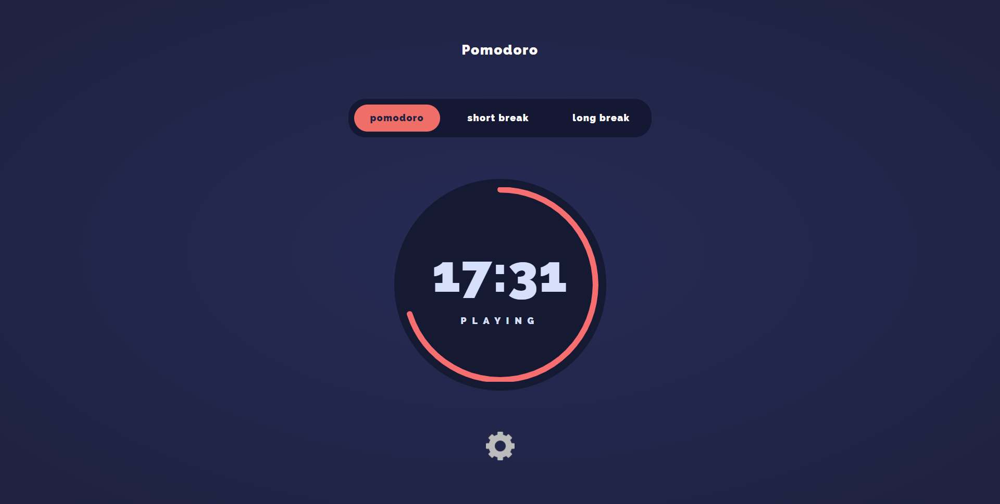

# Pomodoro App VueJS
This challenge was made by Frontend Mentor. [See live preview](https://thecargos.github.io/pomodoro-app/)

## The challenge
Your challenge is to build out this Pomodoro timer app and get it looking as close to the design as possible.

You can use any tools you like to help you complete the challenge. So if you've got something you'd like to practice, feel free to give it a go.

Your users should be able to:

- Set a Pomodoro timer and short & long break timers
- Customize how long each timer runs for
- See a circular progress bar that updates every minute and represents how far through their timer they are
- Customize the appearance of the app with the ability to set preferences for colors and fonts

### Design

### Solution

# Solution

This challenge was made by Frontend Mentor. [See live preview](https://thecargos.github.io/static-job-listings/)

- State Managment
- BEM used

## Techs used
- Vue - Vuex

## My Screenshots